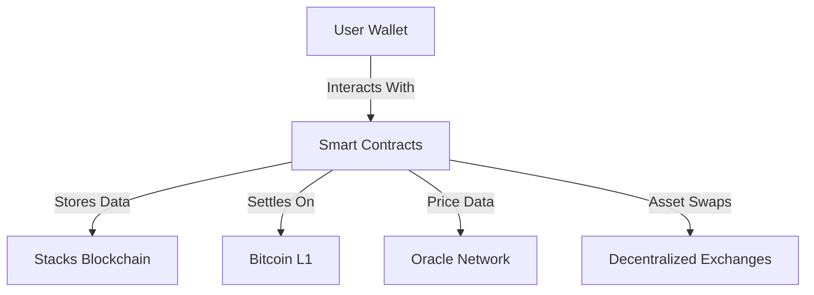

# DynamoFi

## Bitcoin-Native Automated Portfolio Manager on Stacks L2

## Overview

**DynamoFi** is a decentralized, non-custodial portfolio management protocol built on **Stacks**, a Bitcoin Layer 2. It empowers Bitcoin holders to create diversified token portfolios with automated rebalancing, real-time tracking, and full user control.

## Key Features

* **Multi-Asset Portfolios**:
  Create portfolios with up to 10 tokens and custom allocations.

* **Automated Rebalancing**:
  Threshold-based rebalancing triggered approximately every 144 blocks (\~24 hrs).

* **Bitcoin-Native & Non-Custodial**:
  Powered by Stacks smart contracts, secured by Bitcoin finality.

* **Real-Time Portfolio Analytics**:
  Track portfolio value, token weights, and drift metrics on-chain.

* **Configurable Protocol Fees**:
  0.25% fee on operations, adjustable via DAO governance.

* **Secure Ownership Control**:
  Only portfolio creators can rebalance or modify allocations.

## Architecture & Components



### Core Modules

| Component                  | Role                                                           |
| -------------------------- | -------------------------------------------------------------- |
| **Portfolio Manager**      | Portfolio creation, allocation logic, rebalancing coordination |
| **Asset Manager**          | Token whitelisting, oracle pricing, cross-chain compatibility  |
| **Rebalancing Engine**     | Drift detection, rebalance triggers, transaction batching      |
| **User Management System** | Ownership control, portfolio ID mapping, access restrictions   |

## Smart Contract Logic (Clarity)

### Data Structures

| Name              | Description                                      |
| ----------------- | ------------------------------------------------ |
| `Portfolios`      | Metadata (owner, timestamps, value, token count) |
| `PortfolioAssets` | Allocation data per portfolio and token index    |
| `UserPortfolios`  | List of user-owned portfolio IDs                 |

### Key Functions

#### Public

* `create-portfolio`: Initializes a portfolio with token list and target allocations
* `rebalance-portfolio`: Manually rebalances based on market drift
* `update-portfolio-allocation`: Adjusts target weights for a given token
* `initialize`: Sets protocol ownership (admin-only)

#### Read-Only

* `get-portfolio`, `get-user-portfolios`, `calculate-rebalance-amounts`, etc.

#### Private

* Allocation validators, token checks, helper mappings

### Example

```clarity
(create-portfolio
  (list 'SP...token-a 'SP...token-b)
  (list u4000 u6000) ;; 40% and 60%
)
```

## Rebalancing Logic

* Triggered every \~24 hrs (144 blocks) if drift exceeds defined thresholds
* Compares actual vs. target allocation (basis points)
* Outputs required adjustments (actual swaps handled externally)

## Error Handling

| Code    | Description                     |
| ------- | ------------------------------- |
| ERR-100 | Unauthorized access             |
| ERR-101 | Invalid portfolio ID            |
| ERR-102 | Insufficient balance            |
| ERR-103 | Invalid token address           |
| ERR-104 | Rebalancing failed              |
| ERR-105 | Portfolio already exists        |
| ERR-106 | Allocation percentage invalid   |
| ERR-107 | Max tokens exceeded (limit: 10) |
| ERR-108 | Allocation length mismatch      |

## Security & Constraints

* **Strict Ownership Enforcement**: Only creator can modify or rebalance
* **Allocation Validation**: Must total 10,000 basis points (100%)
* **Immutable Contracts**: No upgrade paths, time-locked admin
* **Circuit Breakers**: Emergency freeze functions available
* **Storage Limits**: Max 20 portfolios per user, 10 tokens per portfolio

## Deployment & Administration

* **Protocol Owner**: Assigned via `initialize`
* **Fees**: Default 0.25%, modifiable via governance
* **Token Governance**: Planned DAO-based whitelisting and upgrades

## Integrations & Roadmap

### Compatible With:

* DEXs like **Alex**, **Velar**
* Oracle providers for price feeds
* DAO platforms for decentralized curation

### Roadmap:

* ✅ Portfolio creation, rebalancing, on-chain tracking
* 🔄 Native token swap integrations
* 📈 Live price feed oracles
* 🗳 DAO-managed portfolio templates
* 🏦 Multi-sig support for institutions

## Developer Notes

* Written in [Clarity](https://docs.stacks.co/docs/clarity), deployed on Stacks mainnet/testnet
* Frontend and off-chain services needed for price fetching, token swaps
* Contributions welcome via PRs

## Summary

| Property        | Value                            |
| --------------- | -------------------------------- |
| Protocol Type   | DeFi / Portfolio Automation      |
| Chain           | Stacks (Bitcoin Layer 2)         |
| Language        | Clarity                          |
| Security Anchor | Bitcoin L1 via Stacks consensus  |
| Core Capability | Portfolio automation & analytics |

**Built for Bitcoin. Powered by Stacks. Automated by DynamoFi.**
Let your portfolio manage itself — securely and on-chain.
